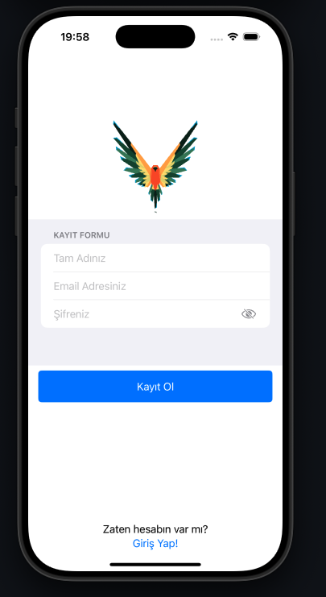
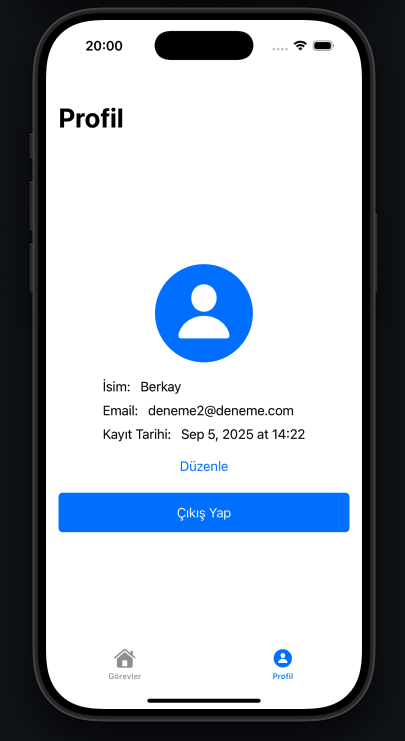
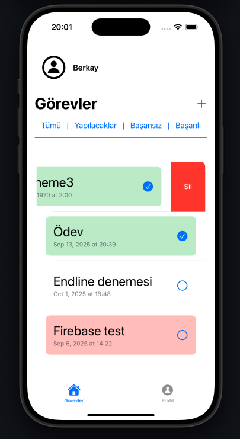
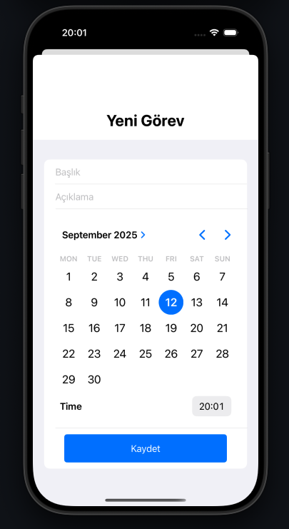

⚠️ **WARNING**  

This is a **LEARNING PROJECT** that I built while exploring mobile app development so it may contain bugs. Maybe I'll improve it in the future.
It may look simple, but it represents my **first step into mobile app development** 

#  📌 TodoApp
This project is my small step into **mobile app development**.  
The app allows:

- Registering and logging UI within Firebase  
- Adding new tasks  
- Marking tasks as completed 
- Deleting tasks that are no longer needed  

The app is built with **Swift**, **Xcode**, and **Firebase**.

---

## Technologies Used
- Swift  
- Xcode  
- Firebase  

---

## 📸 Screenshots & 🎥 Demo

 --> [Download Demo Video](screenshots/demo.mp4)

